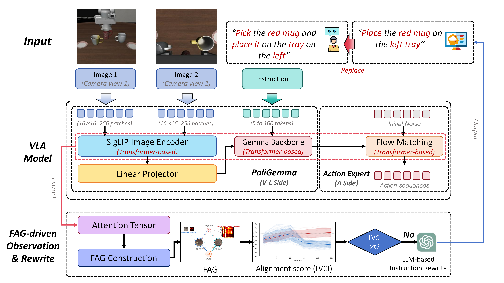
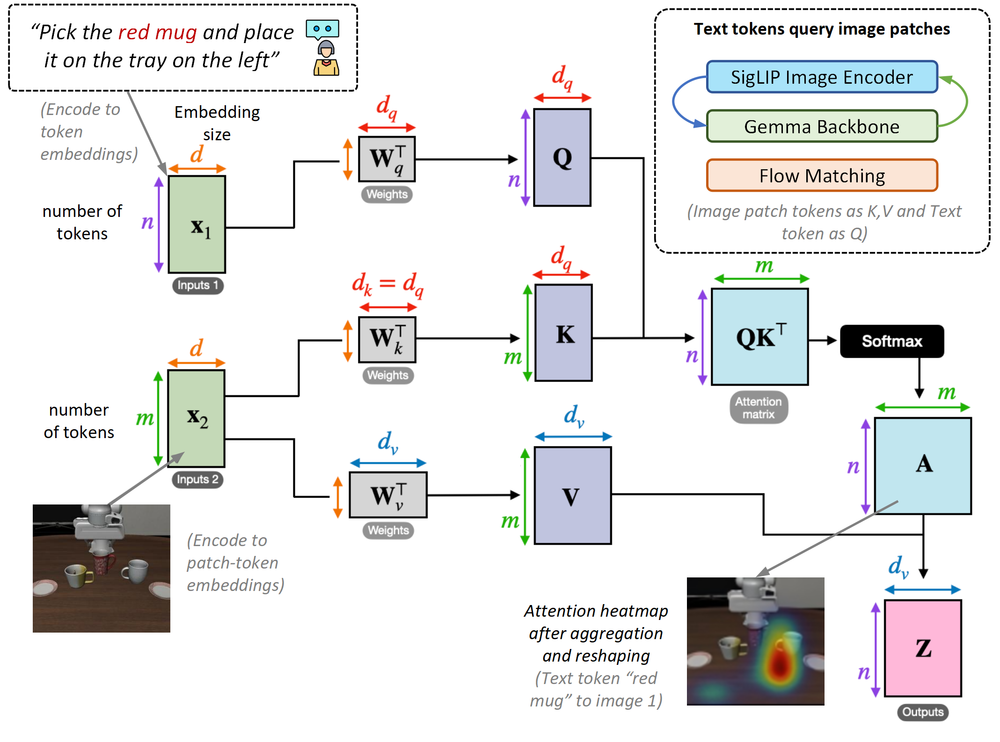

<h1 align="center">FAG-VLA</h1>

<p align="center">
  <b>面向 VLA 模型的融合注意力图谱干预框架</b>
</p>

<p align="center">
  
</p>

<p align="center">
  <a href="#1-研究动机">动机</a> ·
  <a href="#2-框架结构">框架</a> ·
  <a href="#3-主要结果">结果</a> ·
  <a href="#4-安装">安装</a> ·
  <a href="#5-快速使用">快速使用</a> ·
  <a href="#6-配置">配置</a> ·
  <a href="#7-引用">引用</a>
</p>

---

FAG-VLA 是一个 **无需训练** 的可解释性驱动干预框架，用于 `pi0.5` 等双流 VLA（视觉-语言-动作）模型。它在模型推理过程中实时观测跨模态注意力，评估当前的「视觉接地」状态，并仅在模型偏离视觉执行时自适应地改写语言指令。在 LIBERO 上，FAG-VLA 在不微调任何参数的前提下，将 `pi0.5` 成功率从 **93.3 % 提升到 96.7 %**。

> **核心洞察**：在 **成功** 的执行轨迹中，视觉-语言跨模态注意力随时间 **下降**；在 **失败** 的执行轨迹中，该注意力随时间 **上升**。这一「趋势信号」是远比注意力绝对值更强的失败预测信号，也是 FAG-VLA「观测—评估—干预」闭环的核心触发依据。

英文完整说明见 [`README.md`](README.md)。

---

## 1. 研究动机

<p align="center">
  
  <br/>
  <sub><i>注意力的流向：双流 VLA 中图像 patch ↔ 指令 token ↔ 状态 token 之间的跨模态耦合。</i></sub>
</p>

我们对 150 个 LIBERO baseline 执行轨迹（140 成功 / 10 失败）做了系统分析，得到一个反直觉但稳定的现象：

| 指标 | 成功（n=140） | 失败（n=10） | Cohen's *d* |
|---|---|---|---|
| 平均 LVCI | 0.199 | 0.262 | 1.53 *** |
| **LVCI 趋势**（后半 − 前半） | **−0.095** | **+0.049** | **3.96 ***（最强信号）** |
| 平均 VTI | 0.595 | 0.745 | 1.80 *** |
| LVCI < 0.20 步骤占比 | 62.5 % | 13.3 % | 3.56 *** |

当模型 **成功将指令接地到场景** 时，它不再需要反复"翻阅"语言——视觉-语言注意力 **自然衰减**；而当模型 **接地失败** 时，它会持续回查指令，跨模态耦合 **持续上升**。因此 FAG-VLA 的干预触发条件是 **耦合的上升趋势**，而非耦合的高低绝对值。

---

## 2. 框架结构

<p align="center">
  
  <br/>
  <sub><i>FAG-VLA 把一个冻结的 VLA 推理回路用三段闭环包起来：构图、评估、按趋势干预。</i></sub>
</p>

FAG-VLA 由三个模块构成，包裹在一个冻结的 VLA 推理回路上：

1. **融合注意力图谱 FAG**：把 VLM（18 层）与 Action Expert（10 层）的注意力聚合成一张有向加权图，节点 = 图像 patch / 指令 token / 状态 token，边 = 注意力权重。跨模型隐藏状态用余弦相似度桥接。
2. **LV-Coupling 评估器**：计算每步的 LVCI（语言-视觉耦合强度）与其互补量 VGS（视觉接地分数），并追踪 LVCI 的趋势斜率 ΔLVCI。
3. **自适应指令改写器**：三层触发判断 + revert-first 策略：

   ```
   Layer 1（step 0）：VTI₀ ≥ 0.75 且 LVCI₀ ≥ 0.28 → 预防性轻改
   Layer 2（每 50 步）：ΔLVCI > 0.02 且 LVCI ≥ 0.28 且距上次改写 ≥ 2 个 ckpt → 触发
   Layer 3（动作选择）：VTI ≥ 0.85 → LLM front-loading 强改写
                       VTI < 0.85 → 直接 revert 回原始指令
   ```

   关键经验结论：**LLM 改写并非越多越好**——当指令已经发生语义漂移时，恢复原始指令（revert）是最稳的修复；只有在模型严重视觉脱锚（VTI 极高）时，LLM front-loading 才能稳定带来收益。

---

## 3. 主要结果

LIBERO，`pi0.5` checkpoint，50 episodes × 3 tasks：

| 方法 | 成功率 | 相对 baseline |
|---|---|---|
| Baseline `pi0.5` | 93.3 % | — |
| **FAG-VLA（本方法）** | **96.7 %** | **+3.4 pp** |

---

## 4. 安装

```bash
pip install -r requirements.txt
```

`requirements.txt` 已写全所有依赖（`torch`、`numpy`、`networkx`、`scipy`、`transformers`、`openai`、`matplotlib`、`seaborn`、`pillow`、`tqdm`、`einops`、`lerobot` 等）。可选子系统（LIBERO、PIPER SDK、RealSense）列在文件末尾，按需启用。

外部资源需自行下载：

| 资源 | 说明 | 默认路径 |
|---|---|---|
| `pi0.5` LIBERO checkpoint | LeRobot HuggingFace | `./checkpoints/lerobot_pi05_libero` |
| PaliGemma tokenizer | HuggingFace | `./checkpoints/paligemma_tokenizer` |
| LIBERO 数据集 | [LIBERO 仓库](https://github.com/Lifelong-Robot-Learning/LIBERO) | `./datasets/LIBERO_DATASETS` |
| LeRobot 源码（若未 pip 安装） | [LeRobot 仓库](https://github.com/huggingface/lerobot) | 用 `LEROBOT_SRC` 环境变量指定 |

所有默认路径均可通过 `.env` 中同名环境变量覆盖。

---

## 5. 快速使用

```bash
# 配置环境
cp .env.example .env
# 编辑 .env，至少填入 OPENAI_API_KEY（fag_online 模式需要）

# Baseline：纯 pi0.5
python -m fag_vla.fag_eval --mode baseline \
    --tasks libero_object --task_ids "[0,1,2]" --n_episodes 5

# FAG-VLA online：自适应指令改写
python -m fag_vla.fag_eval --mode fag_online --rewrite \
    --tasks libero_object --task_ids "[0,1,2]" --n_episodes 5

# Offline 分析：直接复用已保存的注意力 pkl
python -m fag_vla.fag_eval --mode fag_offline \
    --tasks libero_object --attn_dir ./data/attention_data
```

也可以作为库来用：

```python
from fag_vla.fag_pipeline import FAGPipeline

pipeline = FAGPipeline(
    tokenizer_path="./checkpoints/paligemma_tokenizer",
    save_graphs=True,
    rewrite_enabled=True,
)
result = pipeline.run_offline(
    attn_data_dir="./data/attention_data",
    episode_id=0,
    task_name="libero_object",
)
print(result.mean_alignment, result.rewrite_count)
```

真机评测（PIPER 6DOF + RealSense D435i）：

```python
from fag_vla.piper_d435i_interface import PiperD435iInterface

env = PiperD435iInterface(task_name="pick_metal_bowl",
                          can_port="can0", max_steps=200)
env.connect()
# 接入评测循环即可，详见 fag_eval.py
```

---

## 6. 配置

所有可调参数集中在 [`src/fag_vla/settings.py`](src/fag_vla/settings.py)，可通过环境变量覆盖。常用项：

| 变量 | 默认值 | 含义 |
|---|---|---|
| `FAG_BASE_DIR` | 仓库根目录 | `data/` 等输出目录的根 |
| `POLICY_PATH` | `<repo>/checkpoints/lerobot_pi05_libero` | `pi0.5` 权重 |
| `PALIGEMMA_TOKENIZER_PATH` | `<repo>/checkpoints/paligemma_tokenizer` | tokenizer |
| `LIBERO_DATA_ROOT` | `<repo>/datasets/LIBERO_DATASETS` | LIBERO HDF5 |
| `OPENAI_API_KEY` | *(空)* | `fag_online` 模式必填 |
| `OPENAI_LLM_MODEL` | `gpt-4o-mini` | 改写所用模型 |
| `LVCI_TREND_THRESHOLD` | `0.02` | Layer-2 触发阈值 ΔLVCI |
| `LVCI_FLOOR` | `0.28` | 趋势触发前的最低绝对 LVCI |
| `VTI_STRONG_THRESHOLD` | `0.85` | 高于此值才走 LLM 改写 |
| `REWRITE_COOLDOWN_STEPS` | `2` | 改写后跳过的 checkpoint 数 |

---

## 7. 引用

```bibtex
@misc{fagvla2026,
  title   = {FAG-VLA: Fused Attention Graphs for Adaptive Intervention in Vision-Language-Action Models},
  author  = {Lei Gao and Gang Shen and Wenqiang Hu and Wenbin Chen and Hanhua Chen},
  year    = {2026},
  note    = {华中科技大学 (Huazhong University of Science and Technology)}
}
```

---

## 8. 许可证

本项目以 [MIT License](LICENSE) 发布。

Copyright © 2026 Lei Gao, Gang Shen, Wenqiang Hu, Wenbin Chen, Hanhua Chen，华中科技大学。
